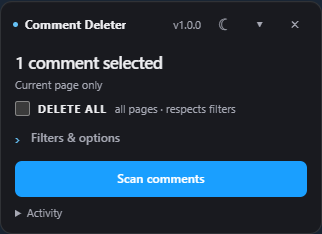
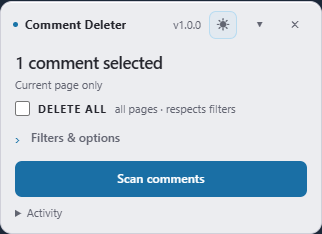
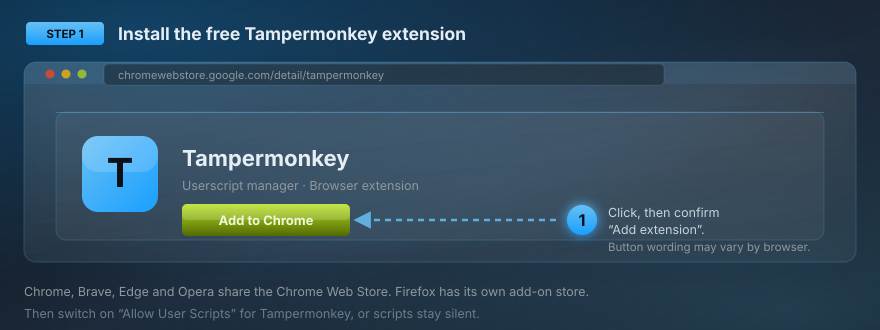
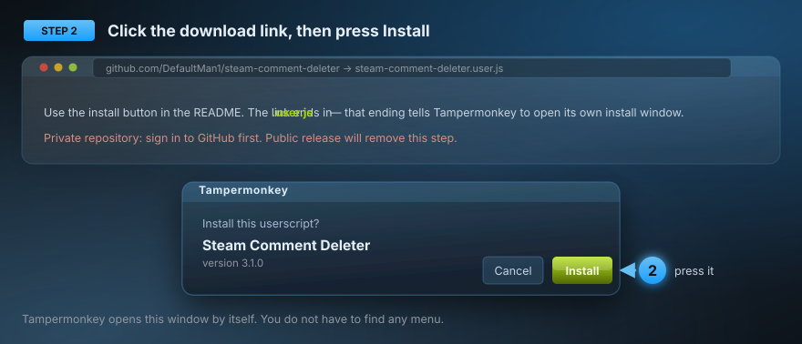

# Steam Comment Deleter

Clean up your Steam profile comments from a small panel right on the page. Scan first, check the selection, then delete.

Light and dark themes. Optional text, author, and date filters. No account setup, runtime dependencies, or telemetry.

[](https://github.com/DefaultMan1/steam-comment-deleter/raw/refs/heads/main/steam-comment-deleter.user.js)

**New here? Install Tampermonkey first using the steps below.**

 

*Actual panel rendered with sample data.*

## Install in Brave

Use Brave on your computer. Already have Tampermonkey? Skip to step 2.

### 1. Get Tampermonkey

**[Get Tampermonkey](https://www.tampermonkey.net/)**

Choose the Chrome download for Brave. On the extension store page, click **Add to Chrome**, then **Add extension**. That button name is normal in Brave.

Next, paste `brave://extensions` into the address bar. Find **Tampermonkey**, click **Details**, and turn on **Allow User Scripts**. If your browser does not offer that switch, see [Tampermonkey's instructions](https://www.tampermonkey.net/faq.php#Q209).



### 2. Install the comment deleter

**[Install Steam Comment Deleter](https://github.com/DefaultMan1/steam-comment-deleter/raw/refs/heads/main/steam-comment-deleter.user.js)**

Tampermonkey should show an installation screen. Check that it says **Steam Comment Deleter 1.0.0**, then click **Install**.



### 3. Open Steam

**[Open your Steam profile](https://steamcommunity.com/my/)** and sign in if needed. Reload the page. The **Comment Deleter** panel should appear, showing **v1.0.0**.

The browser opens its own approval screens during installation. Return here after each step; you do not need to download the whole repository or run a terminal command.

<details>
<summary>The install link shows code or downloads a file</summary>

1. Click the browser's extensions icon, then **Tampermonkey → Dashboard**.
2. Click **Create a new script** (the plus tab).
3. Open [the script file](steam-comment-deleter.user.js) on GitHub and use **Copy raw file** to copy the complete code.
4. In Tampermonkey's editor, select all existing text and replace it with the copied code.
5. Press **Ctrl+S**, then reload your Steam profile.


</details>

<details>
<summary>The panel does not appear</summary>

Check that Tampermonkey and the script are enabled, **Allow User Scripts** is on, and you are on a Steam profile page. Reload after changing these settings. Friends, inventory, groups, and comment-history pages are not supported.
</details>

*Installation illustrations show the steps; browser wording may vary.*

## Delete comments

1. Leave **DELETE ALL** unchecked to work on the current page, or tick it to include later pages. Filters still apply.
2. Optional: open **Filters & options** to narrow the selection or mark comments to keep.
3. Click **Scan comments**. This does not delete anything.
4. Check the highlighted comments and scope, then click **Delete**.
5. Use **Stop** or **Escape** to stop further actions.

Deletion is permanent. Stop cannot recall a request Steam has already received. The tool does not save copies of comments.

The **×** closes the idle panel; reload the profile to reopen it. Filters and Activity start collapsed. The theme button switches between light and dark.

## How selection works

- Text filters match literal text, ignoring case. Separate terms with commas. Regular expressions are not supported.
- Author filters match a complete display name, SteamID, or profile URL.
- Date filters use your local calendar days. Comments with unknown dates are excluded when a date filter is active.
- Changing filters, Keep selections, or page content requires a new scan.
- Only comments with a Delete control supplied by Steam are eligible. Profile owners may be able to delete other people's comments.

**DELETE ALL** processes available pages with the same filters, up to **500 submitted operations per run**. Later pages are not individually previewed. The tool stops after three consecutive failed or uncertain attempts. For more than 500 comments, scan again and start another run.

Operations run one at a time, with a 0.5–0.9 second pause after each settled attempt, plus Steam's response time. Background-tab speed is not guaranteed.

## Privacy

The script uses Steam's existing controls. Steam makes the resulting network requests. The tool has no backend, reads no account credentials, and sends no comments to a third party. Browser storage retains local preferences. A browser execution lock prevents simultaneous deletion runs in multiple tabs.

## Compatibility

Tested with **Brave and Tampermonkey**. A user reported successful installation and real Steam comment deletion. Automated tests cover filtering, validation, the panel workflow, and simulated Steam responses. Firefox is included in CI, but live Steam use in Firefox is not verified.

Steam can change its page structure. If a deletion cannot be confirmed, check Activity and inspect the profile before trying again.

## Development

One readable userscript, no build step, no runtime dependencies. Tests use Node and Playwright.

```sh
npm ci
npx playwright install chromium firefox
npm test
npm run test:browser:firefox
```

The test suite includes synthetic failure scenarios and a sanitised Steam-shaped fixture. These complement live testing; they do not reproduce every Steam condition.

Found a problem? [Open an issue](https://github.com/DefaultMan1/steam-comment-deleter/issues) with your browser version, what you expected, and the Activity message. Please omit personal comment text and account details.

Contributions are welcome. See [CONTRIBUTING.md](CONTRIBUTING.md) for the test commands and what to include in a pull request.

## License

[MIT](LICENSE).

---

```text
                         __     _
                    _.-"/  _.-"/   __
               __.-"  /.-"  /__.-" /
          _.-"/    / /    /      _/___
       .-'   /____/ /____/____.-"     /
      /   .--------------------.   _/
     /   /   ________________    \   \
    /   /_.-"________________"-._\   \
   |   /__________________________\  |
   |  |  _______________________  | (())
   |  | /                       \ | (())
   |  |/       DefaultMan1       \|  ||
  _|__ /============/\============\ ||
 / __ \\___________/  \___________/ ||
| /  \ |     .    / __ \   .     |  /
| |==| |    .   . \____/ .   .   | /
| |==| |     .    _______   .    |/
| |==| |\      . /_[_]___\    . /\
| |__| | \       \______/      /  \
 \____/   \__________________/   /\
 /    \    \\                // /  \
/______\    \\   __________ // /    \
|      |     \\ /          \ /      |
|      |      \(    ____    )/       |
|______|       /   /    \   \        |
```
